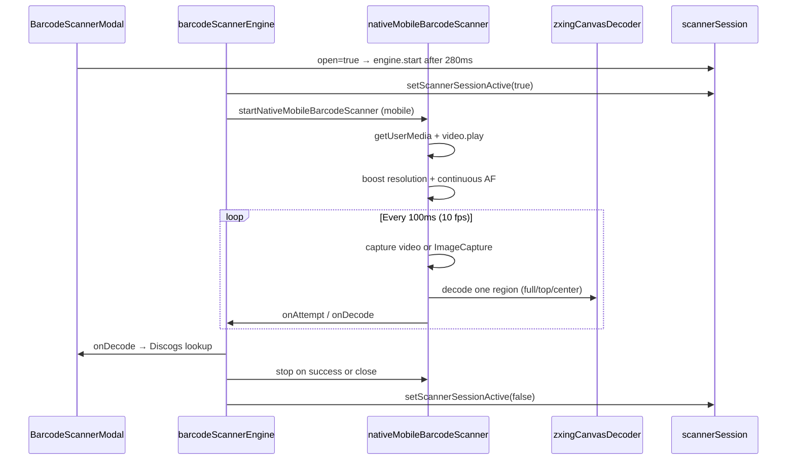

# Barcode Scanner Architecture (scanner-v13)

## Flow



## Desktop flow

```
barcodeScannerEngine.start
  → new Html5Qrcode(containerId)
  → scanner.start(camera, { fps: 12, qrbox, videoConstraints })
  → enableScannerEnhancements (continuous AF on mobile-only path; no-op desktop)
  → onDecode via html5-qrcode callback
```

## Module contracts

### `barcodeScannerEngine`

- `start(containerId, callbacks)` — calls `stop()` first; assigns session id
- `stop()` — increments session id (invalidates in-flight async); stops tracks
- `tapToFocus` — desktop html5 only
- Re-exports `SCANNER_BUILD`, `SCANNER_FPS_*` from `scannerConfig`

### `nativeMobileBarcodeScanner`

Callbacks:
- `onDecode(text, format)` — return `false` to keep scanning
- `onAttempt('full' | 'strip')` — strip = center region
- `onMetrics({ width, height, captureMethod, decoder })`
- `onStatus(message)` — shown in debug panel
- `onStall()` — watchdog fired; engine sets "Recovering scanner…"

### `scannerSession`

```ts
setScannerSessionActive(true)  // engine.start
isScannerSessionActive()       // useCollection visibilitychange guard
setScannerSessionActive(false) // engine.stop
```

### `BarcodeScannerModal`

- **Only** `open` in scanner `useEffect` deps (+ stable `beginScan`, `reset`)
- Callbacks via `engineCallbacksRef` — always latest, no effect re-run
- `shouldFlushDebug` — throttles React state updates
- Never import `startNativeMobileBarcodeScanner` directly

## Capture strategy (mobile)

| Tick | Capture | Region |
|------|---------|--------|
| 0 | video | full |
| 1 | ImageCapture | top |
| 2 | video | center |
| 3 | ImageCapture | full |
| … | alternates | rotates |

Strip regions use 40% height, min 120px; top strip offset 6% from top.

## ZXing pipeline

1. Downscale so max dimension ≤ 1440px
2. Portrait (h > w × 1.15): try rotations 0°, 90°, 270°
3. Landscape: try 0°, 180°
4. HybridBinarizer first, then GlobalHistogramBinarizer
5. On stall: `resetBarcodeDecoder()` clears cached `MultiFormatReader`

## Collection sync guard

`useCollection.ts` visibility handler:

```ts
if (isScannerSessionActive()) return; // do not refreshRecords while scanning
```

Without this, background fetch + React re-render can interact badly with the modal even with the engine pattern.